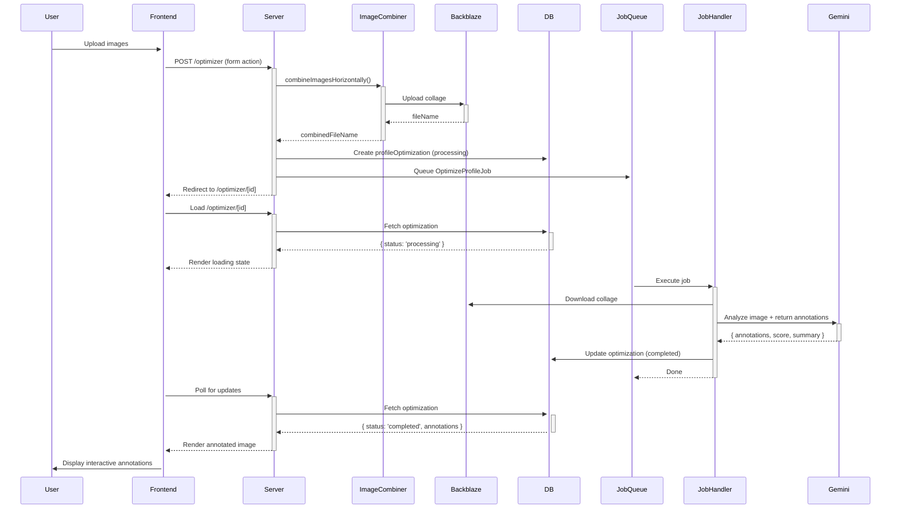

# Tech Design: Profile Bio Optimizer with Visual Annotations

## Overview

Create an AI-powered profile bio optimizer that combines multiple profile screenshots into a collage and overlays interactive annotations suggesting specific improvements. Think Figma/Canva comments but for dating profile optimization.

## Core User Flow

1. User uploads 1-5 profile screenshots via existing `ImageHandler`
2. Backend combines images into horizontal collage using existing `ImageCombinerService`
3. Gemini analyzes the collage and returns structured suggestions with **coordinates**
4. Frontend displays collage with interactive annotation overlays (arrows, boxes, tooltips)
5. User can click annotations to see detailed suggestions

---

## Backend Architecture

### 1. New LLM Inference Type

**File:** `src/lib/server/services/llm/types.ts`

```typescript
export enum LLMInferenceType {
  GENERATE_RIZZ_RESPONSE = "GENERATE_RIZZ_RESPONSE",
  ANALYZE_DATING_BIO = "ANALYZE_DATING_BIO",
  OPTIMIZE_PROFILE = "OPTIMIZE_PROFILE", // NEW
}
```

### 2. New Prompt in PromptHelper

**File:** `src/lib/server/services/llm/prompt-helper.ts`

Add method `generateProfileOptimizerPrompt()` that instructs Gemini to:
- Analyze the profile collage image
- Identify specific areas for improvement (photos, bio text, prompts)
- Return **structured JSON** with:
  - Suggestion text
  - Type (photo, bio-text, prompt, overall)
  - **Bounding box coordinates** (x, y, width, height as percentages)
  - Severity (critical, moderate, minor)

**Example LLM Response Schema:**
```typescript
{
  "overallScore": 7.5,
  "summary": "Strong profile with good photos, but bio could use more personality",
  "annotations": [
    {
      "id": "ann_1",
      "type": "photo",
      "severity": "moderate",
      "title": "Great smile!",
      "suggestion": "This photo is excellent - genuine smile and good lighting. Consider moving it to first position.",
      "boundingBox": { "x": 10, "y": 15, "width": 20, "height": 30 } // % of image
    },
    {
      "id": "ann_2",
      "type": "bio-text",
      "severity": "critical",
      "title": "Add hobbies",
      "suggestion": "Your bio is too generic. Add 2-3 specific hobbies or interests to make it memorable.",
      "boundingBox": { "x": 45, "y": 60, "width": 40, "height": 15 }
    }
  ]
}
```

**Key Insight:** Gemini 2.5 Flash has vision capabilities and can estimate positions of elements in images. Instruct it to return bounding boxes as percentages of the total image dimensions.

### 3. New Job Handler

**File:** `src/lib/server/job-handlers/optimize-profile/job-handler.ts`

Similar to `AnalyzeBioJobHandler`, but:
- Fetches combined collage image from Backblaze
- Calls Gemini with `OPTIMIZE_PROFILE` prompt
- Stores result in a new `profileOptimizations` table (see DB schema below)

### 4. Database Schema

**New Table:** `profile_optimizations`

```typescript
{
  id: string (uuid)
  userId: string
  combinedImageFileName: string  // The collage stored in Backblaze
  overallScore: number
  summary: string
  annotations: JSON // Array of annotation objects
  status: 'processing' | 'completed' | 'failed'
  createdAt: timestamp
  updatedAt: timestamp
}
```

### 5. Updated Server Action

**File:** `src/routes/optimizer/+page.server.ts`

```typescript
export const actions = {
  optimize: async ({ request, locals }) => {
    if (!locals.user) return fail(401, { error: "Unauthorized" });

    const formData = await request.formData();
    const imageFileNames = formData.getAll("imageFileNames") as string[];

    // Combine images (already implemented)
    const combinedFileName = await ImageCombinerService.combineImagesHorizontally(
      imageFileNames,
      locals.user.id
    );

    // Create optimization record
    const optimization = await actions.createProfileOptimization({
      userId: locals.user.id,
      combinedImageFileName: combinedFileName,
      status: 'processing'
    });

    // Queue background job
    await new OptimizeProfileJobHandler({
      userId: locals.user.id,
      optimizationId: optimization.id,
      fileName: combinedFileName,
    }).call();

    // Redirect to results page
    redirect(303, `/optimizer/${optimization.id}`);
  },
} satisfies Actions;
```

---

## Frontend Architecture

### 1. New Route: Optimization Results Page

**File:** `src/routes/optimizer/[id]/+page.svelte`

**Key Components:**
1. **Image Canvas Container** - Displays the collage with relative positioning
2. **Annotation Overlays** - Absolutely positioned SVG elements (arrows, boxes)
3. **Annotation Cards** - Tooltip/popover components with suggestion text
4. **Overall Score Display** - Header showing score + summary

### 2. Component Structure

```
optimizer/[id]/+page.svelte
├── OptimizationHeader.svelte (score, summary)
├── AnnotatedImageCanvas.svelte (main component)
│   ├──  (the collage)
│   ├── AnnotationOverlay.svelte (repeated for each annotation)
│   │   ├── AnnotationMarker.svelte (arrow/box SVG)
│   │   └── AnnotationCard.svelte (tooltip with text)
│   └── ...
└── ActionButtons.svelte (regenerate, download, etc.)
```

### 3. AnnotatedImageCanvas Component

**File:** `src/lib/ui/optimizer/AnnotatedImageCanvas.svelte`

**Key Features:**
- Container with `position: relative` to hold image + annotations
- Calculate absolute pixel positions from percentage-based bounding boxes
- Handle responsive scaling (image may resize on different screens)
- Track active annotation (hover/click to show detailed card)

**Technical Approach:**
```svelte
<script lang="ts">
  import { onMount } from 'svelte';

  let { annotations, imageUrl } = $props<{
    annotations: Annotation[];
    imageUrl: string;
  }>();

  let imageRef: HTMLImageElement;
  let containerDimensions = $state({ width: 0, height: 0 });
  let activeAnnotationId = $state<string | null>(null);

  // Calculate actual pixel positions from percentage bounding boxes
  const getPixelPosition = (bbox: BoundingBox) => ({
    left: (bbox.x / 100) * containerDimensions.width,
    top: (bbox.y / 100) * containerDimensions.height,
    width: (bbox.width / 100) * containerDimensions.width,
    height: (bbox.height / 100) * containerDimensions.height,
  });

  onMount(() => {
    // Update dimensions on image load and window resize
    const updateDimensions = () => {
      if (imageRef) {
        containerDimensions = {
          width: imageRef.offsetWidth,
          height: imageRef.offsetHeight,
        };
      }
    };

    imageRef.addEventListener('load', updateDimensions);
    window.addEventListener('resize', updateDimensions);

    return () => {
      window.removeEventListener('resize', updateDimensions);
    };
  });
</script>

<div class="relative">
  

  {#each annotations as annotation}
    {@const pixelPos = getPixelPosition(annotation.boundingBox)}
    <AnnotationOverlay
      {annotation}
      position={pixelPos}
      isActive={activeAnnotationId === annotation.id}
      onclick={() => activeAnnotationId = annotation.id}
    />
  {/each}
</div>
```

### 4. Annotation Visual Styles

**Types of Annotations:**

1. **Photo Annotations** - Colored bounding box + corner badge
   ```css
   border: 3px dashed #10b981; /* green for positive */
   border: 3px dashed #f59e0b; /* amber for moderate */
   border: 3px dashed #ef4444; /* red for critical */
   ```

2. **Text Annotations** - Arrow pointing to text + floating card
   - Use SVG `<path>` for curved arrows
   - Animated pulse effect on marker

3. **Overall Annotations** - Floating badge (no bounding box)

**Example AnnotationMarker Component:**
```svelte
<!-- For bounding box style -->
<div
  class="absolute border-3 border-dashed rounded-lg pointer-events-none"
  class:border-green-500={annotation.severity === 'minor'}
  class:border-amber-500={annotation.severity === 'moderate'}
  class:border-red-500={annotation.severity === 'critical'}
  style:left="{position.left}px"
  style:top="{position.top}px"
  style:width="{position.width}px"
  style:height="{position.height}px"
>
  <!-- Badge with annotation number -->
  <div class="absolute -top-3 -right-3 w-6 h-6 rounded-full bg-blue-500
              text-white text-xs flex items-center justify-center animate-pulse">
    {annotation.id.split('_')[1]}
  </div>
</div>
```

### 5. Loading State

While optimization is processing:
- Show loading spinner + progress message
- Use SvelteKit's `load` function to fetch optimization status
- Auto-refresh every 2s if status is still 'processing'

---

## Data Flow



---

## Implementation Steps

### Phase 1: Backend Foundation (Day 1)
1. ✅ Add `OPTIMIZE_PROFILE` to `LLMInferenceType`
2. ✅ Create `generateProfileOptimizerPrompt()` in `PromptHelper`
3. ✅ Create DB migration for `profile_optimizations` table
4. ✅ Create `OptimizeProfileJobHandler`
5. ✅ Update `/optimizer/+page.server.ts` action

### Phase 2: Test LLM Output (Day 1-2)
1. ✅ Write prompt to ensure Gemini returns valid bounding boxes
2. ✅ Test with sample profile images
3. ✅ Adjust prompt if coordinates are inaccurate
4. ✅ Add validation for annotation schema

### Phase 3: Frontend Core (Day 2-3)
1. ✅ Create `/optimizer/[id]/+page.svelte` route
2. ✅ Create `AnnotatedImageCanvas.svelte`
3. ✅ Implement bounding box coordinate calculations
4. ✅ Handle image loading and responsive scaling

### Phase 4: Annotation UI (Day 3-4)
1. ✅ Create `AnnotationOverlay.svelte`
2. ✅ Create `AnnotationCard.svelte` (tooltip with suggestion)
3. ✅ Add hover/click interactions
4. ✅ Style different severity levels
5. ✅ Add animations (pulse, fade-in)

### Phase 5: Polish (Day 4-5)
1. ✅ Add loading states with polling
2. ✅ Add error handling
3. ✅ Add "Regenerate" button
4. ✅ Add "Download Annotated Image" feature (optional)
5. ✅ Mobile responsive testing

---

## Tech Stack & Dependencies

**Existing (No changes needed):**
- ✅ `@google/genai` - Gemini API
- ✅ `fluent-ffmpeg` - Image combining
- ✅ Backblaze - Storage
- ✅ Drizzle ORM - DB operations

**New Dependencies:**
- None! Use existing Svelte/Tailwind for all UI

**Optional Enhancements:**
- `html2canvas` - If you want to export annotated image as downloadable PNG
- `@floating-ui/svelte` - For better tooltip positioning (if needed)

---

## Alternative Approaches Considered

### Approach 1: Canvas-based Rendering
**Pros:** Pixel-perfect annotation placement
**Cons:** More complex, harder to make interactive, accessibility issues
**Decision:** ❌ Not recommended

### Approach 2: Client-side Vision API
**Pros:** Faster, no backend processing
**Cons:** Expensive API calls, less accurate, harder to cache
**Decision:** ❌ Not recommended

### Approach 3: SVG Overlay Layer (RECOMMENDED)
**Pros:**
- Simple HTML/CSS positioning
- Fully responsive
- Easy interactions (hover, click)
- Accessible
- Can layer multiple annotations
**Decision:** ✅ **This is the approach outlined above**

---

## Key Technical Decisions

1. **Why percentage-based bounding boxes?**
   - Images are displayed at different sizes (mobile vs desktop)
   - Percentages scale naturally with responsive design
   - Gemini can estimate positions relative to image dimensions

2. **Why horizontal collage vs grid?**
   - Simpler ffmpeg logic (already implemented)
   - Better for mobile viewing (vertical scroll)
   - Easier bounding box calculations

3. **Why background job vs synchronous?**
   - Gemini API can be slow (5-15 seconds)
   - Prevents timeouts on Vercel (10s limit)
   - Better UX with loading states

4. **Why not use Gemini's native bounding box API?**
   - Gemini 2.5 Flash doesn't have built-in object detection for arbitrary elements
   - Prompt engineering to return coordinates is more flexible
   - Can annotate text elements, not just photos

---

## Example Prompt for Gemini

```typescript
private static generateProfileOptimizerPrompt(): string {
  return dedent`
    You are RizzGPT, an expert dating profile optimizer. Analyze the provided dating profile image collage and provide specific, actionable suggestions for improvement.

    The image contains a horizontal collage of 1-5 screenshots from a dating profile. Analyze:
    1. Photo quality, variety, and order
    2. Bio text (personality, interests, hooks)
    3. Prompts and answers
    4. Overall profile vibe and appeal

    For each suggestion, estimate the bounding box coordinates as percentages:
    - x: left edge position (0-100%)
    - y: top edge position (0-100%)
    - width: box width (0-100%)
    - height: box height (0-100%)

    Return a JSON object with this EXACT structure:
    {
      "overallScore": <number 0-10>,
      "summary": "<2-3 sentence overall assessment>",
      "annotations": [
        {
          "id": "ann_1",
          "type": "photo" | "bio-text" | "prompt" | "overall",
          "severity": "critical" | "moderate" | "minor",
          "title": "<Short title (4-6 words)>",
          "suggestion": "<Detailed actionable suggestion>",
          "boundingBox": { "x": <number>, "y": <number>, "width": <number>, "height": <number> }
        }
      ]
    }

    Provide 4-8 annotations covering the most impactful improvements.
  `;
}
```

---

## Mockup (Text Description)

```
┌─────────────────────────────────────────────────┐
│  Profile Optimization Score: 7.5/10 ⭐          │
│  "Strong photos but bio needs personality"       │
└─────────────────────────────────────────────────┘

┌─────────────────────────────────────────────────┐
│  [Combined Profile Image]                        │
│                                                   │
│  ╔═══════════╗        ╔════════════╗            │
│  ║  Photo 1  ║  (1)   ║  Photo 2   ║            │
│  ║ Great!    ║────────║            ║            │
│  ╚═══════════╝        ╚════════════╝            │
│       │                                           │
│       └─► Annotation Card:                       │
│           "Excellent genuine smile!              │
│            Move to first position."              │
│                                                   │
│  ┌──────────────────┐      (2)                   │
│  │  Bio Text Area   │◄──────┐                   │
│  └──────────────────┘       │                   │
│                              │                    │
│                       Annotation Card:           │
│                       "Add specific hobbies"     │
└─────────────────────────────────────────────────┘

[Regenerate] [Download Report]
```

---

## Summary

This design leverages your existing infrastructure (ffmpeg, Gemini, Backblaze) while adding a modern, interactive annotation layer. The key innovation is prompting Gemini to return bounding box coordinates, which enables Canva-style visual feedback without complex computer vision libraries.

**Estimated effort:** 4-5 days for full implementation
**Complexity:** Medium (mostly frontend UI work)
**User value:** High (unique feature, great UX)

---

## Next Steps

Ready to implement! Start with Phase 1 (Backend Foundation) and validate the LLM output quality before building the frontend.
